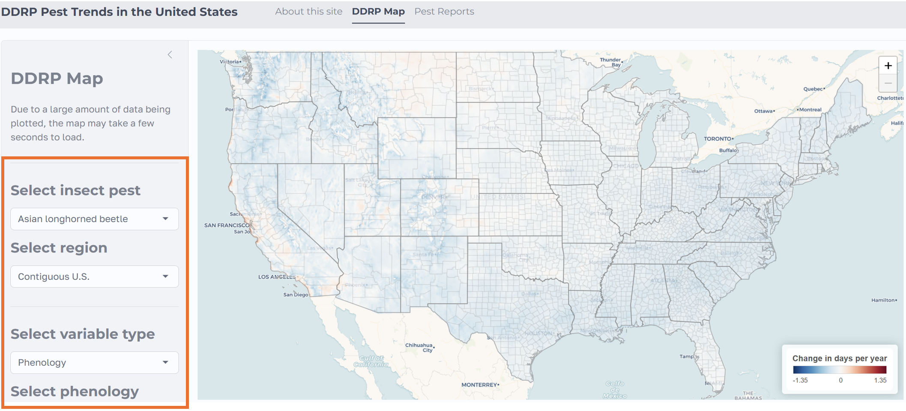

## Purpose

This tutorial decribes how to use the **D**egree **D**ay, Establishment **R**isk, and **P**henological (DDRP) trend mapping system for the contiguous United States. This map was developed by modelers from the Oregon IPM Center, located at Oregon State University.

## Requirements

To use the mapping tool, you will need access to internet connection and a computer (this may be a desktop, laptop, tablet, or smartphone). The application runs on common web browsers, such as Google Chrome, Mozilla Firefox, and Microsoft Edge. The application window is designed to automatically adjust and accomodate different screen sizes.

## Map Controls

Upon opening the mapping tool, map controls will be present on the left side on the screen.

The inputs will be preset and a map will display automatically. These presets may be changed based on your desired output. Below, we outline the available options: \newline

#### i. Insect pest

18 invasive pest species have model outputs available. See table below for specifics.

| Species | Common name | Present in United States | National Priority Pest | Federal Program Pest |
|---------------|---------------|---------------|---------------|---------------|
| *Anoplophora glabripennis* | Asian longhorned beetle | **Yes** | **Yes** | **Yes** |
|  |  |  |  |  |
| *Chilo suppressalis* | Asiatic rice borer | No | **Yes** | No |
|  |  |  |  |  |
| *Cryptoblabes gnidiella* | Christmas berry or honeydew moth | No | **Yes** | No |
|  |  |  |  |  |
| *Spodopthera litura* | Common or cotton cutworm | No | **Yes** | No |
|  |  |  |  |  |
| *Agrilus planipennis* | Emerald ash borer | **Yes** | No | **Yes** |
|  |  |  |  |  |
| *Spodopthera littoralis* | Egyptian cottonworm | No | No | No |
|  |  |  |  |  |
| *Thaumatotibia leucotreta* | False codling moth | No | **Yes** | No |
|  |  |  |  |  |
| *Popillia japonica* | Japanese beetle | **Yes** | No | **Yes** |
|  |  |  |  |  |
| *Monochamus alternatus* | Japanese pine sawyer beetle | No | No | No |
|  |  |  |  |  |
| *Epiphyas posvittana* | Light brown apple moth | **Yes** | No | **Yes** |
|  |  |  |  |  |
| *Platypus quercivorus* | Oak ambrosia beetle | No | **Yes** | No |
|  |  |  |  |  |
| *Helicoverpa armigera* | Old world bollworm | No | **Yes** | **Yes** |
|  |  |  |  |  |
| *Dendrolimus pini* | Pine-tree lappet moth | No | **Yes** | No |
|  |  |  |  |  |
| *Autographa gamma* | Silver Y moth | No | **Yes** | No |
|  |  |  |  |  |
| *Neoleucinodes elegantalis* | Small tomato borer | No | **Yes** | No |
|  |  |  |  |  |
| *Lycorma delicatula* | Spotted lanternfly | **Yes** | **Yes** | **Yes** |
|  |  |  |  |  |
| *Eurygaster integriceps* | Sunn pest | No | **Yes** | No |
|  |  |  |  |  |
| *Tuta absoluta* | Tomato leaf miner | No | **Yes** | No |

### ii. Region

All 48 states in the United States. In other words, Alaska and Hawaii are not included.

### iii. Variable type

- **Climate stress** - Pertains to environmental temperature stress accumulation on the pest.

- **Phenology** - Pertains to landmark life cycle stages of the pest.

- **All stress exclusion** -

### iv. Climate variable (will show if Variable type = "Climate stress")

- Cold stress

- Heat stress

### v. Phenology metric (will show if Variable type = "Phenology")

- **First adult emergence** - Estimated date of when first generation adults would start emerging.

- **First egg hatch** - Estimated date of when eggs of the first generation adults would start hatching.

### vi. Metric

- **Direction of trend (**$\tau$**)** - This statistic is a measure of the trend based on the Mann-Kendall test. The Mann-Kendall test determines if a time series contains a monotonic trend over time. As such, positive values of $\tau$ suggest an upward trend, and negative values of $\tau$ suggest a downward trend. P-values less than 0.05 suggest that the trend is statistically significant from zero (no trend).

- **Change in days per year (Sen's slope)** - This statistic is another measure of the trend based on the Mann-Kendall test. Sen's slope is interpreted the same as any slope. For example, if the Sen's slope is 0.3, then in this context the change (positive or negative) is occurring at a rate of 0.3 per year.

- **Climate stress exclusion** - The cumulative link model (CLM) was used to assess changes in predictions in potential distributions, given that those predictions are categorical (in this case, no / moderate / severe climate stress exclusion). The coefficient that outputs from the CLM can either be indicative of an increase (positive coefficient) or decrease (negative coefficient) in the likelihood of establishment owing to reductions in survival-limiting climate stressors.

### vii. Time range

- **1981-2025** - Provides trend information accounting for the *historical* time period.

- **1981-2000**

- **2001-2025** - Provides trend information accounting for the *more recent* time period.

## Description of Maps
