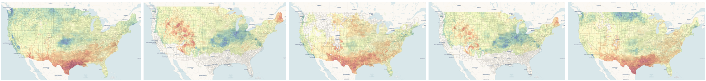

## Overview

We use the Degree-Day, establishment Risk, and Phenological (DDRP) event mapping system to assess the potential impacts of weather from 1980 to the current year on the timing of pest activity such as emergence (phenology) and potential for establishment of 18 invasive pest species in the contiguous United States.

::: {.callout-tip collapse="true"}
## Open to see more info on the 18 species

Of the 18 species with models, 12 are presently on Plant Protection and Quarantine’s National Priority Pest List. Six were formerly included on the list, and two are Federal Program Pests. Most of the species do not occur in the contiguous United States (N = 13); however, five are established and may spread to additional regions. Real-time forecasts for these pests are available at [USPEST.org](https://uspest.org/CAPS).

| Species | Common name | Present in United States | National Priority Pest | Federal Program Pest |
|---------------|---------------|---------------|---------------|---------------|
| Anoplophora glabripennis | Asian longhorned beetle | **Yes** | **Yes** | **Yes** |
| Chilo suppressalis | Asiatic rice borer | No | **Yes** | No |
| Cryptoblabes gnidiella | Christmas berry webworm | No | **Yes** | No |
| Spodopthera litura | Common or cotton cutworm | No | **Yes** | No |
| Agrilus planipennis | Emerald ash borer | **Yes** | No | **Yes** |
| Spodopthera littoralis | Egyptian cottonworm | No | No | No |
| Thaumatotibia leucotreta | False codling moth | No | **Yes** | No |
| Popillia japonica | Japanese beetle | **Yes** | No | **Yes** |
| Monochamus alternatus | Japanese pine sawyer beetle | No | No | No |
| Epiphyas posvittana | Light brown apple moth | **Yes** | No | **Yes** |
| Platypus quercivorus | Oak ambrosia beetle | No | **Yes** | No |
| Helicoverpa armigera | Old world bollworm | No | **Yes** | **Yes** |
| Dendrolimus pini | Pine-tree lappet moth | No | **Yes** | No |
| Autographa gamma | Silver Y moth | No | **Yes** | No |
| Neoleucinodes elegantalis | Small tomato borer | No | **Yes** | No |
| Lycorma delicatula | Spotted lanternfly | **Yes** | **Yes** | **Yes** |
| Eurygaster integriceps | Sunn pest | No | **Yes** | No |
| Tuta absoluta | Tomato leaf miner | No | **Yes** | No |
:::

The system is part of a suite of decision-support tools at [USPEST.org](https://uspest.org/wea/) that are developed and maintained by the Oregon Integrated Pest Management Center (OIPMC) at Oregon State University. These tools provide thousands of end users nationwide with information to support timely and effective management activities for agricultural pests and diseases. This project will use the DDRP event mapping system to predict where pests may exhibit earlier activities, increases in the number of generations, and increases in habitat suitability. This information helps Plant Protection and Quarantine allocate survey resources more strategically, thereby reducing the likelihood of pest establishment and spread.

The DDRP event mapping system is distinct from existing pest decision-support systems in its combination of

-   integrated phenology and habitat suitability mapping to fully address both when and where a pest life stage may occur over a year,

-   incorporation of biologically meaningful parameters that increase model realism in contrast with simple degree-day models, and

-   inclusion of survival-limiting cold and heat stresses to predict habitat suitability over a year, whereas most other systems use simpler models based on weather averages (Barker et al. 2020; Grevstad et al. 2022; Barker et al. 2023).

Additionally, its ability to accept daily weather data for any time frame allows evaluation of historical conditions and impacts of weather changes on pest phenology and establishment.

## Source Code & Feedback

To view the source code, please visit this GitHub repository: [DDRP Pest Trends](https://github.com/bbarker505/DDRP_pest_trends) \newline

For any questions or comments regarding this work, please feel free to reach out to Dr. Brittany Barker at [brittany.barker\@oregonstate.edu](brittany.barker@oregonstate.edu).

## References

-   Barker, B. S., L. Coop, T. Wepprich, F. Grevstad, and G. Cook. 2020. Public Library of Science ONE 15:e0244005. <https://doi.org/10.1371/journal.pone.0244005>

-   Barker, B. S., L. Coop, J. J. Duan, and T. R. Petrice. 2023. Frontiers in Insect Science 3:1239173. <https://doi.org/10.3389/finsc.2023.1239173>

-   Barker, B. S., and L. Coop. 2024. Digger. June 2024, pp. 41−45. Online at: [https://diggermagazine.com/new-tools-to-forecast-boxwood-blight-infection-risk-in-pacific- northwest-nurseries/](https://diggermagazine.com/new-tools-to-forecast-boxwood-blight-infection-risk-in-pacific-%20northwest-nurseries/)

-   Takeuchi, Y., A. Tripodi, and K. Montgomery. 2023. Frontiers in Insect Science 3:1198355. <https://doi.org/10.3389/finsc.2023.1198355>
